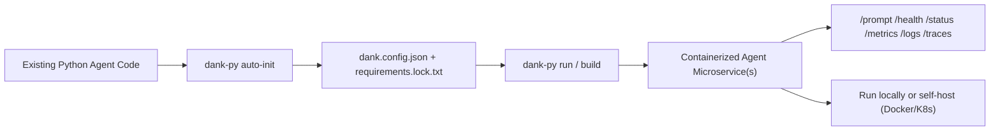

# dank-py

<p align="left">
  
  
  
  
</p>

<p align="left">
  <a href="https://pypi.org/project/dank-py/">PyPI</a>
  ·
  <a href="https://cloud.dank-ai.xyz">Dank Cloud</a>
</p>

Framework-agnostic Python CLI for turning existing agent code into Dockerized HTTP microservices with a consistent runtime contract.

Turn existing Python agents into production-ready microservices in two commands, with no agent-code rewrites:
- no code rewrites required,
- standardized HTTP runtime contract,
- repeatable dependency locking + validation,
- built-in observability (status, metrics, logs, traces),
- optional multi-agent bundling for runtime efficiency.

If you want managed infrastructure instead of self-hosting containers, use [Dank Cloud](https://cloud.dank-ai.xyz).  
Dank Cloud can onboard directly from your GitHub repo and handles packaging, deploys, scaling, auth, logging/tracing & monitoring, and supporting infra (like hosted vector DB + MCP) for you.

In short:
- `dank-py`: local/self-hosted packaging and runtime control.
- Dank Cloud: managed microservice deployment and operations, built on top of `dank-py`.

## Table of Contents

- [Why dank-py](#why-dank-py)
- [In 2 Commands](#in-2-commands)
- [Architecture](#architecture)
- [Install](#install)
- [Quick Start](#quick-start)
- [Command Reference](#command-reference)
- [Configuration Reference (`dank.config.json`)](#configuration-reference-dankconfigjson)
- [Runtime API Contract](#runtime-api-contract)
- [Logging and Observability](#logging-and-observability)
- [Environment and Secrets](#environment-and-secrets)
- [Build vs Build:Prod](#build-vs-buildprod)
- [Agent Examples](#agent-examples)
- [Troubleshooting](#troubleshooting)
- [Release](#release)

## Why dank-py

- Works with existing agent code
  - Framework-agnostic support across LangChain, LangGraph, CrewAI, PydanticAI, LlamaIndex, or custom OpenAI/SDK implementations.
  - Auto-inspects entrypoints and I/O hints to bootstrap `dank.config.json`.
- Production-ready runtime out of the box
  - Consistent endpoints (`/health`, `/prompt`, `/status`, `/metrics`, `/logs`, `/traces`).
  - Input/output contract validation and strict output enforcement.
  - Native async/sync invocation handling for agent callables and methods.
  - Request tracing with trace IDs, per-agent log streams, and trace retrieval endpoints.
- Reliable build and dependency flow
  - Resolver-based lock generation (`requirements.lock.txt`).
  - Isolated validation in temporary virtual environments before build/run.
  - Build and production build workflows for local iteration and release pipelines.
- Flexible multi-agent deployment
  - Run each agent in its own container, or bundle agents into one container with header-based routing.
  - Reduce footprint for compatible agents while keeping per-agent observability.

## In 2 Commands

```bash
dank-py auto-init --strict
dank-py run
```

That flow will:
1. inspect your project and generate `dank.config.json`,
2. infer and lock dependencies,
3. validate agents in an isolated environment,
4. build and run containerized agent service(s).

## Architecture



## Install

### Requirements

- Python `>=3.11` (supported host range)
- Python `3.12` is the target runtime/lock version
- Docker CLI + running Docker daemon

### Install from PyPI

```bash
pip install dank-py
```

### Editable install (local development)

```bash
pip install -e /absolute/path/to/dank-py
```

Both command names are available:
- `dank`
- `dank-py`

## Quick Start

```bash
# 1) Scaffold config and ignore files
dank-py init

# 2) Inspect project and apply candidates
dank-py inspect

# 3) Resolve dependency lock
dank-py deps

# 4) Build and run
dank-py run
```

One command setup:

```bash
dank-py auto-init
```

Strict setup (includes full isolated validation):

```bash
dank-py auto-init --strict
```

## Command Reference

### Version

Quick version check:

```bash
dank-py -v
# or
dank-py --version
# or
dank-py version
```

What it shows:
- installed `dank-py` CLI version
- configured default base image reference
- Docker availability status
- installed local `dank-py-base` image tags (if any)

Flags for `dank-py version`:

| Flag | What it does |
| --- | --- |
| `--json` | Outputs version/base-image details as JSON for tooling/scripts. |

### `dank-py init`

Scaffold `dank.config.json` and `.dankignore`.

```bash
dank-py init [name] [--force]
```

| Arg/Flag | What it does |
| --- | --- |
| `name` | Optional target directory. If omitted, uses current directory. |
| `--force` | Overwrites existing scaffold files instead of leaving them untouched. |

### `dank-py auto-init`

Runs init + inspect apply + deps in one flow.

```bash
dank-py auto-init [name] [flags]
```

| Arg/Flag | What it does |
| --- | --- |
| `name` | Optional target directory for scaffolding. |
| `--force` | Overwrites existing scaffold files. |
| `--validate-dry` | Runs isolated non-live validation after lock creation. |
| `--validate-full` | Runs isolated live validation (real env vars and non-mock outputs expected). |
| `--strict` | Alias for `--validate-full`. |
| `--fallback-freeze` | Allows lock fallback via `pip freeze` when resolver lock cannot be produced. |
| `--no-discover-imports` | Disables import discovery when no dependency metadata exists. |
| `--install-tools` | Auto-installs missing resolver tooling (`pip-tools`) in the active environment. |
| `--no-install-prompt` | Disables interactive prompts for tool installation. |
| `--lock-python-version <ver>` | Sets lock target Python version (default `3.12`). |
| `--include-lock-comments` | Keeps resolver metadata comments in `requirements.lock.txt`. |
| `--no-refresh-lock` | Reuses existing lock file instead of regenerating it. |

### `dank-py deps`

Generates or refreshes `requirements.lock.txt`, optionally validates agents.

```bash
dank-py deps [flags]
```

| Flag | What it does |
| --- | --- |
| `--project-dir <dir>` | Uses a specific project directory (defaults to current directory). |
| `-c, --config <path>` | Path to `dank.config.json` for validation modes. |
| `--validate-dry` | Runs isolated non-live validation. |
| `--validate-full` | Runs isolated live validation. |
| `--fallback-freeze` | Allows `pip freeze` fallback when resolver lock fails. |
| `--no-discover-imports` | Disables import-based dependency discovery. |
| `--install-tools` | Auto-installs `pip-tools` if missing. |
| `--no-install-prompt` | Disables prompt asking to install missing tools. |
| `--lock-python-version <ver>` | Sets lock target Python version (default `3.12`). |
| `--include-lock-comments` | Keeps resolver metadata comments in lock output. |
| `--no-refresh-lock` | Reuses existing lock instead of regenerating. |

### `dank-py inspect`

Scans project files for likely agent entrypoints and model/schema hints.

```bash
dank-py inspect [flags]
```

| Flag | What it does |
| --- | --- |
| `--project-dir <dir>` | Uses a specific project directory. |
| `--json` | Prints machine-readable inspect output only (no interactive prompts). |
| `--interactive` | Explicitly runs interactive apply flow (default behavior when not using `--json`). |
| `--apply` | Applies selected candidate(s) directly to config. |
| `--candidate-index <N>` | Chooses a specific 1-based candidate index when applying. |
| `-c, --config <path>` | Path to target `dank.config.json`. |

### `dank-py build`

Builds local target image(s).

```bash
dank-py build [selector] [flags]
```

Selectors (mutually exclusive):

| Selector | What it does |
| --- | --- |
| `--agent <id-or-name>` | Builds one standalone agent target. |
| `--bundle <bundle-name>` | Builds one configured bundle target. |
| `--bundle-agents <csv\|all>` | Builds one ad-hoc bundle from agent list or all agents. |

Build flags:

| Flag | What it does |
| --- | --- |
| `-c, --config <path>` | Path to `dank.config.json`. |
| `--bundle-name <name>` | Names an ad-hoc bundle created with `--bundle-agents`. |
| `--prompt-routing required\|default` | Overrides bundle prompt routing mode. |
| `--default-agent <id-or-name>` | Sets default routed agent when using `prompt-routing=default`. |
| `--tag <tag>` | Sets output image tag (single target). |
| `--base-image <image>` | Overrides base image reference. |
| `--pull-base` | Forces pull of base image before target build. |
| `--no-base-build` | Skips local base-image build fallback if pull fails. |
| `--force-base` | Forces base image rebuild/pull path. |
| `--verbose` | Streams raw Docker build output. |
| `--json` | Returns structured JSON result. |

Default behavior with no selector:
- no bundles configured: builds all agents separately
- bundles configured: builds configured bundles + unbundled agents separately

### `dank-py build:prod`

Buildx-based production build flow.

```bash
dank-py build:prod [selector] [flags]
```

Selector flags are the same as `build`.

Production flags:

| Flag | What it does |
| --- | --- |
| `-c, --config <path>` | Path to `dank.config.json`. |
| `--bundle-name <name>` | Names ad-hoc bundle from `--bundle-agents`. |
| `--prompt-routing required\|default` | Bundle prompt routing override. |
| `--default-agent <id-or-name>` | Default agent for bundle prompt fallback. |
| `--tag <tag>` | Image tag (default `latest`). |
| `--registry <host>` | Registry host for push targets. |
| `--namespace <prefix>` | Repository namespace/prefix. |
| `--tag-by-agent` | Uses agent name as tag with shared namespace repo strategy. |
| `--platform <platform\|auto>` | Buildx platform(s); `auto` chooses based on push/load mode. |
| `--push / --no-push` | Enables/disables push output explicitly. |
| `--load / --no-load` | Enables/disables local Docker load output explicitly. |
| `--no-cache` | Disables build cache. |
| `--base-image <image>` | Base image override. |
| `--pull-base` | Pulls base image before production build. |
| `--force-base` | Forces base image rebuild/pull path. |
| `--output-metadata <file>` | Writes build metadata JSON file. |
| `--verbose` | Streams raw buildx output. |
| `--json` | Returns structured JSON build result. |

### `dank-py run`

Builds (unless `--no-build`) and runs selected target container(s).

```bash
dank-py run [selector] [flags]
```

Selector flags are the same as `build`.

Run flags:

| Flag | What it does |
| --- | --- |
| `-c, --config <path>` | Path to `dank.config.json`. |
| `--bundle-name <name>` | Names ad-hoc bundle from `--bundle-agents`. |
| `--prompt-routing required\|default` | Bundle prompt routing override. |
| `--default-agent <id-or-name>` | Default bundle target when prompt header is omitted in default mode. |
| `--tag <tag>` | Uses specific image tag for build/run. |
| `--base-image <image>` | Base image override. |
| `--pull-base` | Pulls base image before building. |
| `--no-build` | Runs existing image without rebuilding. |
| `-d, --detached` | Starts container(s) in detached mode. |
| `--foreground` | Forces foreground attach mode. |
| `--port <host-port>` | Starting host port mapping (auto-increments to avoid collisions). |
| `--force-base` | Forces local base rebuild path. |
| `--keep-build-context` | Leaves generated `.dank-py` build context on disk for debugging. |
| `--verbose` | Streams raw Docker build logs. |
| `--quiet` | Reduces runtime request/startup logging. |
| `--env-file <path>` | Injects env file at runtime (repeatable). |
| `-e, --env KEY=VALUE\|KEY` | Injects explicit env var (repeatable). |
| `--no-auto-env-file` | Disables automatic loading of project `.env`. |
| `--json` | Returns structured run result. |

Run defaults:
- single target: foreground monitor mode
- multi-target: detached mode

### `dank-py logs`

Reads logs from container targets and bundled agent runtime streams.

```bash
dank-py logs [target] [flags]
```

| Arg/Flag | What it does |
| --- | --- |
| `target` | Container name, bundle name, or agent id/name. |
| `-f, --follow` | Follows logs live (streaming mode). |
| `-t, --tail <N>` | Number of lines/events to show (default `100`). |
| `--since <timestamp-or-duration>` | Shows logs only since provided time point/window. |

Routing behavior:
- bundled agent target + `--follow` uses websocket stream
- bundled agent target (non-follow) queries runtime logs endpoint
- container target uses Docker logs

### `dank-py stop`

Stops running dank-py containers.

```bash
dank-py stop [selector] [flags]
```

| Flag | What it does |
| --- | --- |
| `-c, --config <path>` | Path to `dank.config.json`. |
| `--agent <id-or-name>` | Stops one standalone agent target. |
| `--bundle <bundle-name>` | Stops one configured/named bundle container. |
| `--bundle-agents <csv\|all>` | Stops one ad-hoc bundle computed from those agents. |
| `--bundle-name <name>` | Specifies ad-hoc bundle name when used with `--bundle-agents`. |
| `--all` | Stops all running dank-py containers. |
| `--keep` | Stops containers without removing them. |

If no selector is provided, it stops all running dank-py containers.

### `dank-py status`

Displays running/stopped container status and available agent images.

```bash
dank-py status [--json]
```

| Flag | What it does |
| --- | --- |
| `--json` | Prints status payload as JSON for tooling. |

### `dank-py clean`

Removes generated resources.

```bash
dank-py clean [flags]
```

| Flag | What it does |
| --- | --- |
| `--project-dir <dir>` | Project path used for `.dank-py` build-context cleanup. |
| `--all` | Cleans containers, images, and build contexts. |
| `--containers` | Cleans only dank-py containers. |
| `--images` | Cleans only dank-py agent images. |
| `--build-contexts` | Cleans only `.dank-py` build context directories. |
| `--include-base` | Also removes local base image when cleaning images. |

## Configuration Reference (`dank.config.json`)

### Top-level fields

| Field | Type | Required | Notes |
| --- | --- | --- | --- |
| `name` | `string \| null` | no | Project label. |
| `version` | `string` | no | Defaults to `"1"`. |
| `agents` | `AgentConfig[]` | yes | Must contain at least one agent. |
| `bundles` | `BundleConfig[]` | no | Defaults to empty list. |

Validation rules:
- unknown top-level fields are rejected
- `agent.name` and `agent.id` must be unique
- missing `agent.id` is auto-derived from normalized `agent.name`

### `AgentConfig`

| Field | Type | Required | Notes |
| --- | --- | --- | --- |
| `name` | `string` | yes | Human-readable agent name. |
| `id` | `string \| null` | no | Stable routing identity; defaults from name. |
| `entry` | `EntryConfig` | yes | Runtime invocation target. |
| `io` | `IOConfig` | no | Input/output contract definitions. |

### `EntryConfig`

| Field | Type | Notes |
| --- | --- | --- |
| `file` | `string` | Python file path. |
| `symbol` | `string` | Exported function/class/object. |
| `method` | `string \| null` | Method name for object/class entry styles. |
| `call_type` | `auto \| callable \| method` | Invocation target resolution strategy. |
| `call_style` | `auto \| single_arg \| kwargs` | Request payload passing strategy. |

### `IOConfig`

| Field | Type | Notes |
| --- | --- | --- |
| `input.model` | `module:Symbol \| null` | Optional typed input model reference. |
| `input.schema` | `object \| null` | Optional JSON Schema input contract. |
| `output.model` | `module:Symbol \| null` | Optional typed output model reference. |
| `output.schema` | `object \| null` | Optional JSON Schema output contract. |
| `strict_output` | `boolean` | Defaults to `true`. |

Runtime error classes:
- input contract failure: `422`
- invocation parameter mismatch: `400`
- invocation failure: `500`
- strict output contract failure: `500`

### `BundleConfig`

| Field | Type | Required | Notes |
| --- | --- | --- | --- |
| `name` | `string` | yes | Unique bundle identifier. |
| `agents` | `string[]` | yes | Included members by id or name. |
| `prompt_routing` | `required \| default` | no | Defaults to `required`. |
| `default_agent` | `string \| null` | no | Only valid with `prompt_routing: default`. |

Rules:
- bundle names must be unique
- all `agents[]` references must exist
- `default_agent` must belong to its bundle

### Example: Partial bundle + leftover separate agent

```json
{
  "name": "multi-project",
  "version": "1",
  "agents": [
    { "name": "langchain-agent", "id": "langchain-agent", "entry": { "file": "a.py", "symbol": "run" } },
    { "name": "langgraph-agent", "id": "langgraph-agent", "entry": { "file": "b.py", "symbol": "run" } },
    { "name": "custom-agent", "id": "custom-agent", "entry": { "file": "c.py", "symbol": "run" } }
  ],
  "bundles": [
    {
      "name": "lang-bundle",
      "agents": ["langchain-agent", "langgraph-agent"],
      "prompt_routing": "default",
      "default_agent": "langchain-agent"
    }
  ]
}
```

Default `dank-py run` behavior for this config:
- one container for `lang-bundle`
- one separate container for `custom-agent`

## Runtime API Contract

All runtime containers expose:

| Endpoint | Purpose |
| --- | --- |
| `GET /health` | Container health and runtime mode metadata. |
| `POST /prompt` | Agent invocation endpoint (single or bundled routing). |
| `GET /status` | Container/runtime status summary. |
| `GET /status/{agent_id}` | Per-agent status in multi-agent runtime. |
| `GET /metrics` | Process/system metrics snapshot. |
| `GET /logs` | Buffered logs query. |
| `GET /logs/stats` | Log buffer stats. |
| `WS /logs/stream` | Live log stream. |

Trace endpoints:
- `GET /traces` (default/only agent traces)
- `GET /traces/stats` (default/only agent trace stats)
- `GET /traces/{agent_id}`
- `GET /traces/stats/{agent_id}`
- `GET /trace/{trace_id}`

Query filters:
- `GET /logs`: `startTime`, `endTime`, `minutesAgo`, `limit`, `offset`, `stream`
- `GET /traces`, `GET /traces/{agent_id}`: `startTime`, `endTime`, `minutesAgo`, `limit`, `offset`
- `GET /traces/stats`, `GET /traces/stats/{agent_id}`: `startTime`, `endTime`, `minutesAgo`
- `GET /logs/stats`, `GET /trace/{trace_id}`: no query filters

Pagination defaults:
- trace list endpoints default to `limit=100`, `offset=0`
- use `hasMore=true` with `offset` to fetch additional pages

Per-agent live log stream:
- `WS /logs/stream/{agent_id}`

### Bundle prompt routing

Header: `x-dank-agent-id`

- `prompt_routing=required`: header is required.
- `prompt_routing=default`: header is optional; runtime routes to default agent.

Single-agent containers:
- header optional
- mismatched header returns `400`

### Trace headers

- `x-dank-trace-id`
  - Optional request header.
  - If omitted, runtime generates one.
  - Always returned in `/prompt` response header and `metadata.trace_id`.
  - If provided and already present in in-memory trace/log history, runtime returns `409`.
- `x-dank-include-trace`
  - Optional request header (`true|1|yes|on`).
  - When enabled, `/prompt` includes full grouped trace payload in `metadata.trace`.

## Logging and Observability

Runtime keeps an in-memory log buffer and supports:
- query endpoints (`/logs`, `/logs/stats`)
- websocket streaming (`/logs/stream`)
- grouped trace retrieval (`/traces*`)
- bounded retention (`DANK_LOG_BUFFER_MAX_SIZE`, `DANK_LOG_BUFFER_MAX_AGE_MS`, `DANK_LOG_BUFFER_MAX_BYTES`)

`/logs/stats` includes both:
- `bufferSize` (entry count)
- `bufferBytes` (approx current bytes)

CLI support:
- `dank-py logs`
- `dank-py logs --follow <target>`

## Environment and Secrets

### Runtime env injection (recommended)

```bash
dank-py run --env-file .env
# or
dank-py run -e OPENAI_API_KEY=... -e OPENAI_MODEL=gpt-4o-mini
```

By default, `run` auto-loads project `.env` when `--env-file` is not explicitly provided.
Use `--no-auto-env-file` to disable that behavior.

### Build context safety

Use `.dankignore` to keep secrets out of image build context.

Recommended:
- keep `.env` and `.env.*` ignored
- inject secrets at runtime with `--env-file` / `-e`

## Build vs Build:Prod

- `build`
  - local Docker image build
  - best for local development and quick iteration
- `build:prod`
  - buildx workflow for production tagging/loading/pushing
  - suited for CI/CD and registry publish workflows

If you only need local execution, use `run` (or `build` + `run --no-build`).

## Agent Examples

See [`agent-examples/`](./agent-examples) for framework-diverse templates:

- [`01-multi-agent-mixed-repo`](./agent-examples/01-multi-agent-mixed-repo)
- [`02-crewai-kickoff-agent`](./agent-examples/02-crewai-kickoff-agent)
- [`03-pydanticai-structured-agent`](./agent-examples/03-pydanticai-structured-agent)
- [`04-llamaindex-query-agent`](./agent-examples/04-llamaindex-query-agent)
- [`05-langgraph-websearch-agent`](./agent-examples/05-langgraph-websearch-agent)

## Troubleshooting

### Docker not installed/running

```bash
docker version
docker info
```

`dank-py run/build` includes Docker availability checks and remediation prompts.

### Platform mismatch on `build:prod`

Error like `no match for platform in manifest` usually means base image architecture mismatch.

Fixes:
- publish multi-arch base image (`linux/amd64,linux/arm64`), or
- set explicit compatible `--platform`.

### Missing `pip-tools`

```bash
python -m pip install pip-tools
# or
dank-py deps --install-tools
```

### Ambiguous logs target

Use exact container name from `dank-py status`.

## Release

Release and publish workflow:
- [`RELEASE.md`](./RELEASE.md)
- [`scripts/release.py`](./scripts/release.py)

## License

MIT
